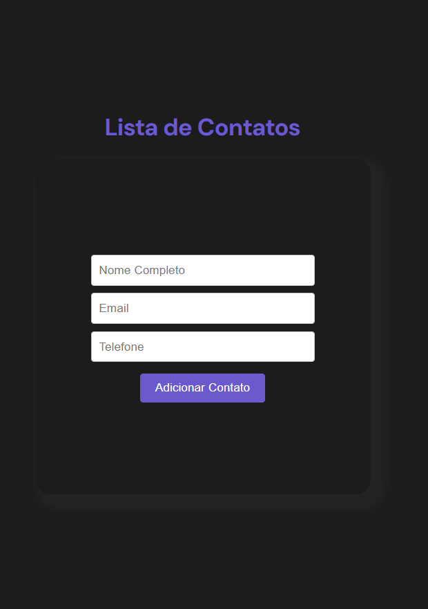

### Informações Relevantes no `README.md`:

- **Descrição do projeto**:
Construíndo uma agenda de contatos com react, styled-components, redux
1) Criar uma lista de contatos utilizando o React.
2) Usar o Redux para gestão dos dados.
3) Utilizar o Styled Components para estilização.
4) Os contatos deverão conter as informações:
- nome completo;
- e-mail;
- telefone;
5) Incluir as funcionalidades:
- adição;
- remoção;
- edição dos itens da lista de contatos.

- **Funcionalidades**: Detalha as principais funcionalidades da aplicação.
- **Tecnologias**: Lista as principais tecnologias utilizadas no projeto.
- **Estrutura do Projeto**:

- **Passos de Configuração**: Explica como instalar e rodar o projeto localmente.
- **Redux**: Descreve o gerenciamento de estado usando Redux.
- **Styled Components**: Aborda como os estilos foram gerenciados.
- **Contribuição**: Orientações para quem deseja contribuir com o projeto.

